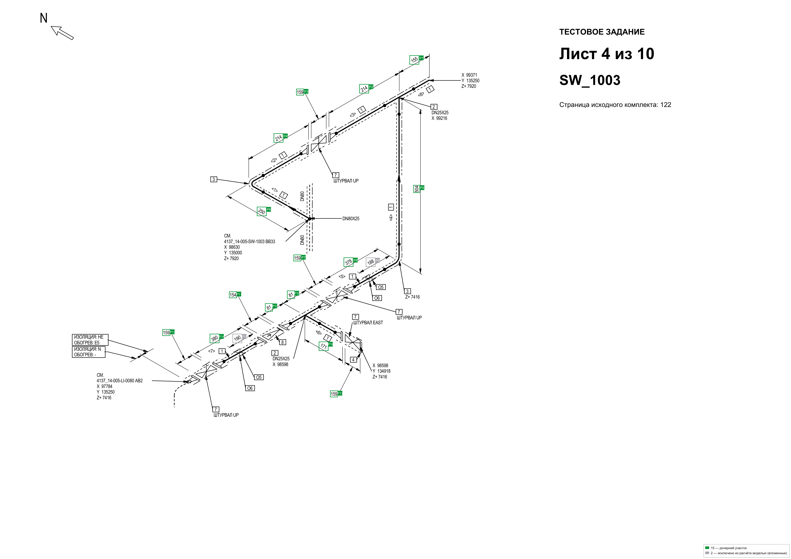

# isokrus — расчёт длины трубопроводов по изометрическим чертежам

Консольная программа: PDF с изометриями → разбор размеров по вектору →
vision-LLM выбирает, какие размеры входят в длину → CSV/Excel с формулой
расчёта и разметка чертежей.

**Результат на эталонном комплекте (10 листов): 10/10 листов точно,
суммарное отклонение 0 мм, ~0,16 руб. и ~10 с на лист.** Модель не читает
и не считает числа: она выбирает метки размеров, сумму складывает программа.

## Что смотреть первым — итоги по заданию

| Результат | Где лежит |
|---|---|
| **Таблица по всем 10 листам**: номер, длина в мм и м, формула, статус, замечания | [`output/exp_13_20261001_235008/result.csv`](output/exp_13_20261001_235008/result.csv) · [Excel](output/exp_13_20261001_235008/result.xlsx) |
| **Разметка чертежей**: на каждом листе видно, какие размеры вошли в расчёт и какие исключены | [`output/exp_13_20261001_235008/annotated/`](output/exp_13_20261001_235008/annotated) — [пример, лист 4](output/exp_13_20261001_235008/annotated/02_Изометрии_10_листов_04_annotated.png) |
| **Описание подхода, модели и ограничений** | [docs/pipeline.md](docs/pipeline.md) · [docs/limitations.md](docs/limitations.md) |
| **Показатели**: время, обращения к ИИ, стоимость страницы | [docs/metrics.md](docs/metrics.md) |
| Сырые ответы модели и статистика прогона | [`responses.json`](output/exp_13_20261001_235008/responses.json) · [`stats.json`](output/exp_13_20261001_235008/stats.json) |

Разметка листа 4 из прогона (зелёные плашки — вошло в расчёт, рядом
обоснование исключений):



## Документация

| Страница | О чём |
|---|---|
| [docs/pipeline.md](docs/pipeline.md) | Схема конвейера, порядок шагов, карта модулей `src/isokrus/` |
| [docs/eda.md](docs/eda.md) | Исследование чертежей: слои PDF, обрезка полей, зачистка, «до/после» |
| [docs/experiments.md](docs/experiments.md) | История exp_01→exp_17: что пробовали, что сработало, сравнение моделей |
| [docs/metrics.md](docs/metrics.md) | Показатели из задания: время, обращения, стоимость с расчётом |
| [docs/limitations.md](docs/limitations.md) | Ограничения, форматы PDF, проверка на новом комплекте |
| [research/ИСТОРИЯ_ИССЛЕДОВАНИЙ.md](research/ИСТОРИЯ_ИССЛЕДОВАНИЙ.md) | Полный отчёт по 74 прогонам с числами |

## Как это работает

```
PDF ──► разбор вектора ──► размеры + отсеянные числа ──► промт
  │        └─► вырез шума из PDF (размер не трогается)
  ▼
рендер ──► обрезка пустых полей ──► подписи текстового слоя ──► промт
  │
  └──► vision-LLM (strict JSON): какие метки входят, какие вложены
  ▼
метки → длины → сумма программой ──► CSV/XLSX + разметка листов
```

Три решения, на которых всё держится:

1. **Геометрия — из вектора PDF, а не от модели.** Размерные линии, стрелки
   и рамки знаков берутся из векторного слоя с точными координатами.
2. **Модель выбирает метки, а не пишет числа.** Ошибка чтения «22100»
   вместо `24100` исключена по построению.
3. **Сумма — программа.** Каждое исключение модель обязана обосновать
   геометрией; расхождения помечаются в отчёте.

## Быстрый старт

```bash
# 1. Установка (Python 3.12+)
python -m venv .venv
.venv\Scripts\activate          # Windows; Linux/macOS: source .venv/bin/activate
pip install -e .

# 2. Конфигурация: скопировать пример и вписать ключ API
copy .env.example .env          # Linux/macOS: cp .env.example .env
#   в .env задать LLM_API_KEY и тарифы LLM_PRICING_TABLE

# 3. Полный цикл по всем листам (эксперимент по умолчанию — exp_01)
python -m isokrus run "02_Изометрии_10_листов.pdf"

# 4. Финальная конфигурация: эксперимент exp_13
python -m isokrus run "02_Изометрии_10_листов.pdf" \
  --experiment exp_13 --model gpt-6-luna --reasoning high
```

Ключ API — от [dslab.tech](https://dslab.tech/): российский шлюз
OpenAI-совместимого API. Выбор по трём причинам: оплата и тарификация
в рублях, работает без VPN, и в одном каталоге доступны все сравнивавшиеся
модели (`gpt-6-luna`, `glm-5.3-flash`, `deepseek-v4.1-flash` и другие) —
это позволило сравнивать модели на одном промте без смены провайдера.

`pip install -e .` обязателен: пакет `isokrus` лежит в `src/` и не публикуется
в PyPI. Ключ API обязателен только для команд `run` и `analyze` — остальные
работают без обращений к API:

```bash
# рендер страниц в PNG без API: обрезка, текстовый слой, размеры
python -m isokrus extract 02_Изометрии_10_листов.pdf --pages 1-10 --output out_pages

# что уходит в промт: разобранные размеры листа 9 и блок текста
python -m isokrus dims 02_Изометрии_10_листов.pdf --which 9
python -m isokrus text 02_Изометрии_10_листов.pdf --which 9

# список экспериментов, схема ответа, текст промта
python -m isokrus experiments
python -m isokrus schema exp_13
python -m isokrus prompt exp_13 --part system
```

### Команды

| Команда | Что делает | Нужен API-ключ |
|---|---|---|
| `run` | полный цикл: извлечение → LLM → CSV/Excel/разметка | да |
| `analyze` | вызов LLM и печать сырого JSON (отладка промта) | да |
| `extract` | рендер страниц в PNG, без обращений к API | нет |
| `text` | извлечённый текст с координатами (блок `{{PDF_TEXT}}`) | нет |
| `dims` | разобранные размеры и отсеянные числа (блок `{{DIMENSIONS}}`) | нет |
| `experiments` | список экспериментов в `research/` | нет |
| `schema` | strict JSON-схема ответа выбранного эксперимента | нет |
| `prompt` | текст системного или пользовательского промта | нет |

Коды возврата: `0` — все листы обработаны, `1` — были ошибки, `2` — ошибка
конфигурации или входных данных.

## Результаты на эталонном комплекте

Эталон — поразмерные ручные замеры по всем десяти листам
(`tests/dimscan/reference.py`, читаемая форма — `reference/list_XX.txt`).
Прогон `exp_13` + `gpt-6-luna` + `high`:

| Лист | Длина, мм | Формула | Эталон | Отклонение |
|---|---|---|---|---|
| 1 | 5 563 | 900 + 2160 + 200 + 600 + 320 + 1383 | 5 563 | 0 |
| 2 | 22 071 | 150 + 10200 + 1900 + 174 + 730 + 5644 + 1406 + 1350 + 293 + 224 | 22 071 | 0 |
| 3 | 6 393 | 264 + 224 + 198 + 210 + 13 + 178 + 228 + 1250 + 200 + 168 + 950 + 146 + 2364 | 6 393 | 0 |
| 4 | 3 218 | 155 + 214 + 159 + 214 + 504 + 250 + 159 + 378 + 81 + 154 + 81 + 159 + 380 + 171 + 159 | 3 218 | 0 |
| 5 | 8 175 | 3505 + 651 + 285 + 850 + 2400 + 34 + 450 | 8 175 | 0 |
| 6 | 10 675 | 3505 + 651 + 285 + 850 + 2400 + 2950 + 34 | 10 675 | 0 |
| 7 | 4 306 | 34 + 840 + 650 + 522 + 1950 + 250 + 60 | 4 306 | 0 |
| 8 | 48 625 | 24100 + 1000 + 23525 | 48 625 | 0 |
| 9 | 860 | 244 + 123 + 123 + 195 + 175 | 860 | 0 |
| 10 | 5 154 | 154 + 220 + 244 + 341 + 188 + 2450 + 134 + 149 + 341 + 244 + 220 + 135 + 134 + 200 | 5 154 | 0 |

Каждая формула — не «модель сказала», а набор размеров, выбранный моделью
и просуммированный программой; в разметке листа видно, какой размер вошёл
и какой исключён с обоснованием.

## Эксперименты с промтом и схемой

Каждая папка в `research/` — отдельная версия промта и структуры ответа,
`exp_01` … `exp_17`. Код при добавлении новой не меняется:

```bash
python -m isokrus run file.pdf --experiment exp_05
```

История исследований, сравнение моделей и выводы:
[docs/experiments.md](docs/experiments.md) и
[research/ИСТОРИЯ_ИССЛЕДОВАНИЙ.md](research/ИСТОРИЯ_ИССЛЕДОВАНИЙ.md).

## Артефакты прогона

`output/exp_NN/`:

| Файл | Содержимое |
|---|---|
| `result.csv` / `result.xlsx` | таблица: лист, обозначение, длина мм/м, формула, статус, замечания |
| `responses.json` | промты и сырые ответы LLM по каждому листу |
| `stats.json` | время, обращения, токены, стоимость, причины ретраев |
| `pages/` | исходные PNG (байты, ушедшие в модель) |
| `annotated/` | PNG с разметкой: что вошло в расчёт, что исключено |
| `to_llm_imgs/` | точные байты, отправленные модели (при подсветке/зачистке) |

## Конфигурация

Все параметры — из окружения, полный список с комментариями: [.env.example](.env.example).
Ключевые:

| Переменная | По умолчанию | Смысл |
|---|---|---|
| `LLM_API_KEY` | — | ключ (обязателен для `run`/`analyze`) |
| `LLM_BASE_URL` | `https://api.dslab.tech/v1` | endpoint OpenAI-совместимого API |
| `LLM_MODEL` | `glm-5.3-flash` | модель |
| `LLM_REASONING_EFFORT` | `high` | режим размышления |
| `MAX_PARALLEL` | `10` | одновременных вызовов LLM |
| `RENDER_DPI` | `320` | плотность рендера |
| `TRIM_MARGINS` | `1` | обрезать пустые поля листа |
| `DIMSCAN` | `1` | разбор размеров по вектору |
| `DIMSCAN_MIN_LENGTH` | `12.0` | мин. длина размерной линии, пункты эталонного листа (масштабируется сам) |
| `LLM_PRICING_TABLE` | — | тарифы по моделям (JSON), для расчёта стоимости |

## Ограничения

Решение рассчитано на PDF с векторной схемой и текстовым слоем (CAD-экспорт).
Форматы без вектора и сканы требуют другого извлекателя координат — граница
изолирована в трёх модулях, остальной конвейер не меняется. Подробно:
[docs/limitations.md](docs/limitations.md).

Суммирование выполняется программой по длинам, которые вернула модель;
правильность самих чисел на чертеже проверяется эталоном `reference/`
и человеком.