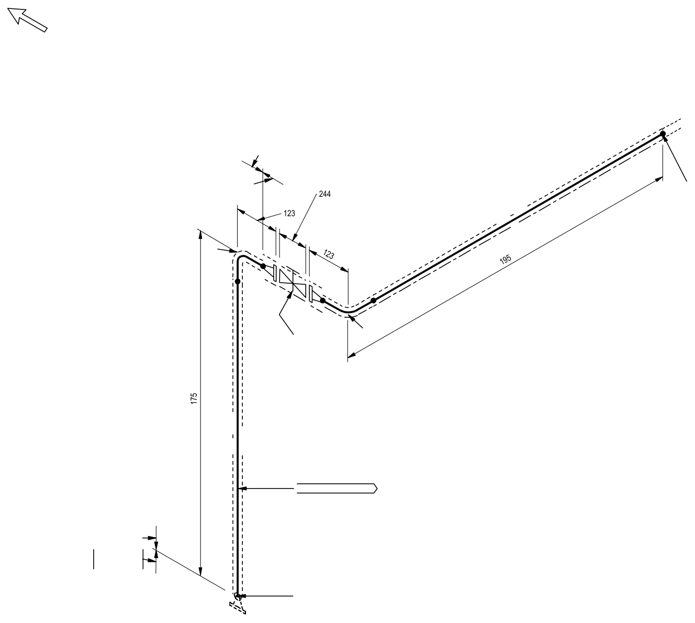
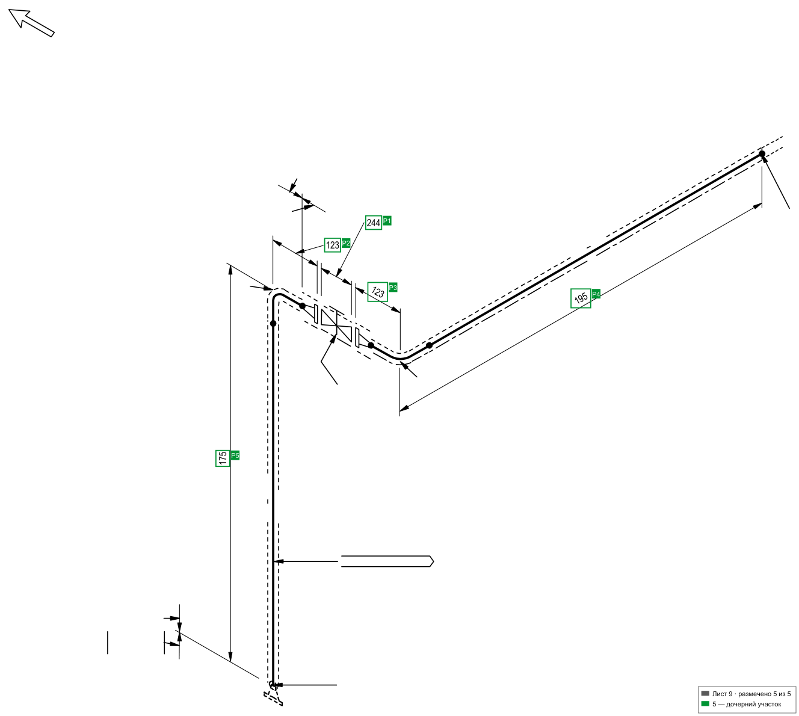
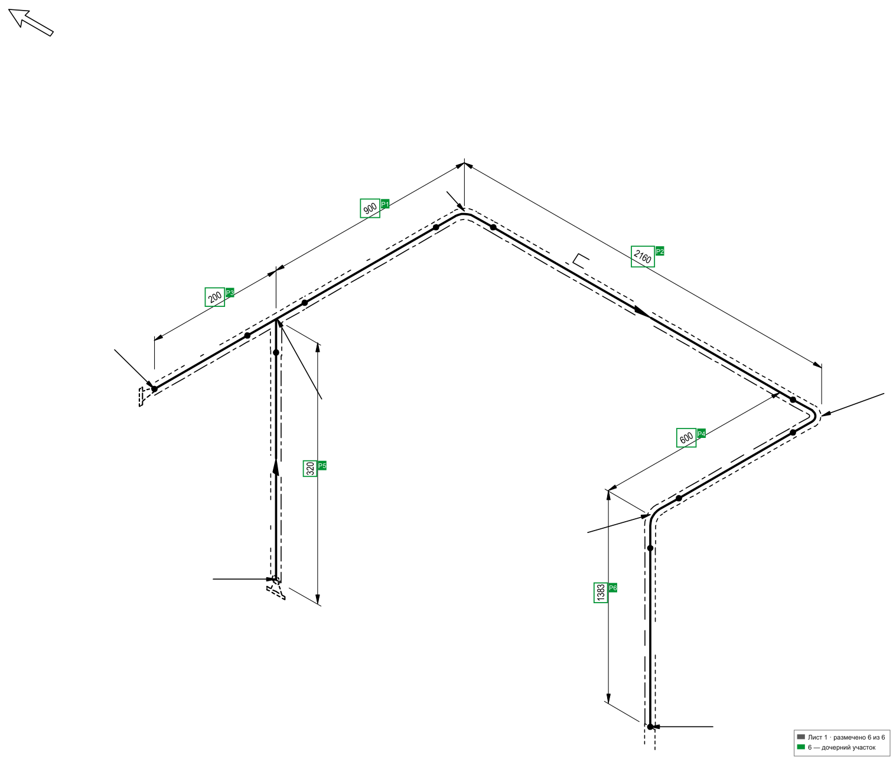

# Исследование чертежей: почему решение именно такое

До того, как писать промт, чертежи разбирали руками и скриптами: что в PDF
нарисовано вектором, что шрифтом, что модель может прочитать с картинки,
а что — нет. Из этого исследования вырос весь конвейер.

## Что внутри листа

Каждый лист — чертёж A3 в PDF, и в нём три слоя данных:

| Слой | Что там | Надёжность |
|---|---|---|
| Вектор | линии трассы, размерные линии со стрелками, рамки знаков | точные координаты в пунктах |
| Шрифт | все подписи: размеры, `X/Y/Z+`, номера узлов, штамп | точные координаты, текст известен |
| Растр | то, что получается рендером всей страницы | то, что видит модель |

Ключевой факт: **подписи на чертеже нарисованы шрифтом, а не картинкой**.
Положение каждого числа известно точно — и это перевернуло подход. Ранние
эксперименты просили модель читать размеры с картинки и возвращать значения;
модель стабильно промахивалась: на пяти листах из десяти и две разные модели
независимо писали «22100» вместо `24100`. Число с картинки попадало прямо
в сумму, и ошибка становилась неотличимой от ошибки выбора.

Теперь модель значения не пишет вовсе: она выбирает метки. Ошибка чтения
стала невозможной по построению.

## Обрезка пустых полей

Лист печатается на формате шире и выше, чем сама трасса: на этом комплекте
пустое поле занимает 32–59 % площади. Vision-модель подгоняет картинку под
свой лимит входа, поэтому пустое поле не стоит ничего, а съедает разрешение:
на обрезанном листе чертёж получает примерно на 25 % больше пикселей
на миллиметр, и размерные подписи читаются.

Рамка содержимого ищется по факту, без заранее заданных полей: цвет пустого
места определяется по левому верхнему углу страницы (белый лист и серый
скан обрабатываются одинаково), строки и столбцы сканируются от краёв внутрь
до первого нарисованного.

## Зачистка: то, что размером не является

Модель получает лист и список размеров одновременно, и всё, что на картинке
похоже на размер, тянет её в расчёт. На девятом листе верны все пять размеров,
но рядом лежат квадраты с «1» и «2» — модель их тоже видит.

Отличить данные привязки от размеров по геометрии текста нельзя. По всем
десяти листам встречаются `Z+ 10695` в 5 px (мусор) и `Z+ 1900` в 55 px
(размер), `DN50X50 174` в 75 px (размер) и `DN50X50 2` в −105 px (мусор).
Зазор между префиксом и числом — не признак.

Единственное проверяемое правило: **вырезается то, что разбор уже отверг**.
Отвергнутое число не попадает в список размеров, и эталонная сумма достигается
подмножеством именно принятых чисел. Зачистка реализована вырезом из PDF
(страница редактируется до рендера), а не закрашиванием по растру: в рендере
не остаётся ни серого ореола от сглаживания, ни обрезка буквы, а подписи
исчезают и из текстового слоя — модель не видит их даже в списке текста.

## До / после

Исходный лист (то, что кладёт на диск `pages/` и что видит человек для сверки).
Лист 9 показательный: пять размеров, рядом квадраты с «1» и «2» — именно они
в ранних прогонах тянулись в сумму:

Разметка листа 9 после прогона: зелёные плашки — пять размеров, вошедших
в длину (860 мм, эталон сходится), легенда в углу показывает «размечено 5 из 5».
Каждая рамка числа берётся из текстового слоя PDF, а не из bbox-оценки модели,
поэтому обводка стоит ровно там, где нарисовано число:

Лист 1: шесть размеров, все вошли — `900 + 2160 + 200 + 600 + 320 + 1383 = 5563 мм`:

## Чего на листах нет, и что это значит

На чертежах нет топологии трассы: ни списка узлов, ни порядка соединения.
Поэтому «перечислить ветви с длинами» модель не может надёжно — ранняя
постановка задачи (`exp_01`–`exp_04`) дала максимум 3/10 точных листов.
Нынешняя постановка («отметь, какие размеры вложены») не требует от модели
восстанавливать топологию: достаточно геометрии проекционных интервалов.
Итог — 10/10 с нулевым суммарным отклонением (см. [эксперименты](experiments.md)).